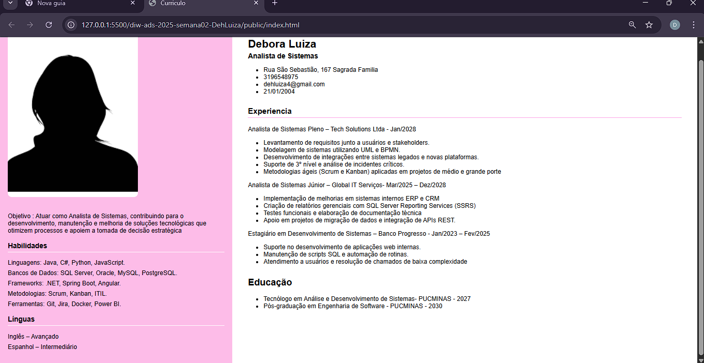
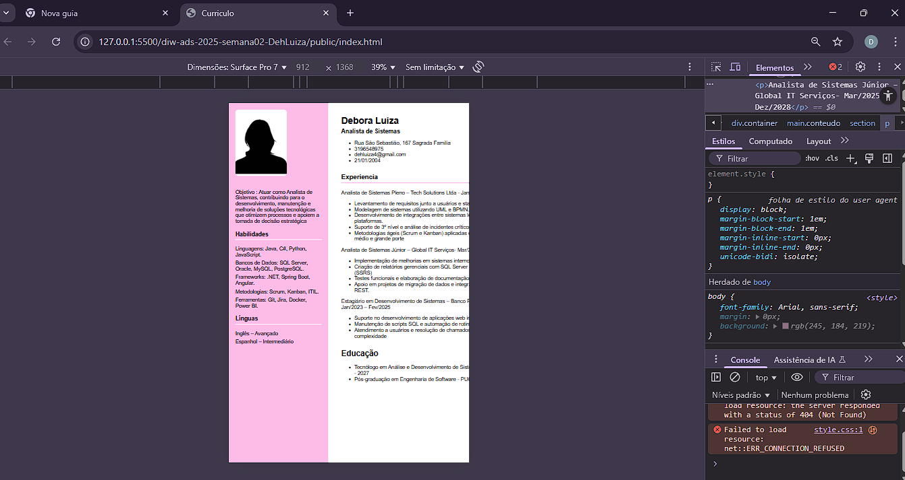

# template-diw-20251-semana-02

## Informações Gerais
- Nome: Debora Luiza 
- Matricula:  875055

## Print da tela da página criada (Curriculum Vitae)

`<Coloque aqui o print da tela de inspeção do seu navegador>`
